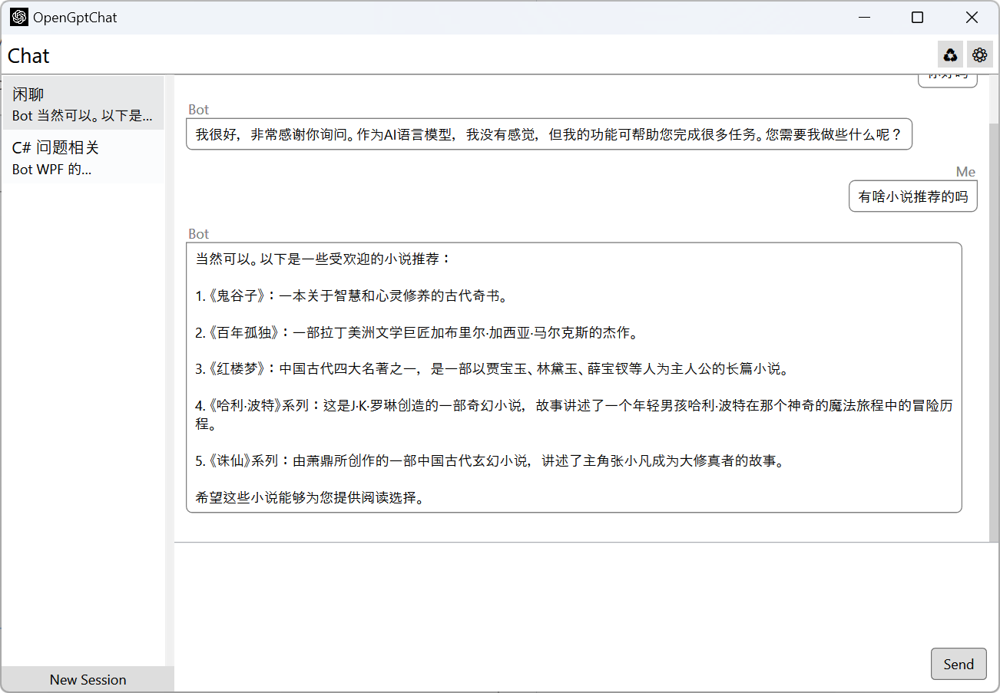

# OpenGptChat 

   /  

A simple chat client based on [Open AI Chat completion API](https://platform.openai.com/docs/guides/chat).

## Usage

1. Download the latest release.
2. Open `OpenGptChat.exe`.
3. Navigate to Configuration page and set your own API key.
4. Enjoy!

> Tips: You can use `Ctrl + Enter` in text box to send message.

## What is API Key

The OpenAI API uses API keys for authentication. Visit your [API Keys](https://platform.openai.com/account/api-keys) page to retrieve the API key you'll use in your requests. Usually, the API key is a secret and do not share it with others.

## What you can learn?

1. Learn **Binding**, **Command**, **Template**, **Style**, **Trigger**, **Animation** in WPF.
2. Use `LiteDB` to save data without SQL.
3. Use `CommunityToolkit.Mvvm` in WPF project.
4. Use `Microsoft.Extensions.Hosting` for DependencyInjection, Configuration.
5. Use `Hardcodet.NotifyIcon.Wpf` to create a notify icon in WPF applciation.
6. Use `Microsoft.Xaml.Behaviors.Wpf` to add more operation functions in WPF application.
7. Use `EleCho.GlobalHotkey.Windows.Wpf` to handle global hotkey in WPF applciation.
